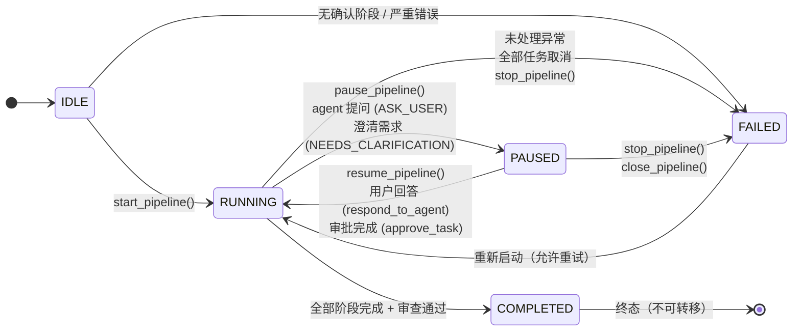

# Pipeline 编排器模块

**版本**: v3.0
**最后更新**: 2026-05-28

---

## 概述

- **功能定位**：项目 Pipeline 全生命周期编排，从需求分析到最终 Review。v2.2 新增阶段确认门控（Stage Review Gate）和 Agent 主动提问机制。
- **所属层级**：backend
- **代码路径**：`backend/app/services/collaboration/pipeline_orchestrator.py`

---

## v3.0 状态机重构 (2026-05-28)

- **移除 `pipeline.paused` 布尔值** — `pipeline.status` 现在是唯一真相来源（参见 [[#pipeline-状态机]]）
- **`_ALLOWED_TRANSITIONS`** — 预定义合法状态转移矩阵，非法转移抛出 `IllegalStateTransition`
- **`PipelineOrchestrator.transition()`** — 统一状态转移入口，自动校验 + 记录日志
- **`test_pipeline_state_machine.py`** — 23 个参数化测试覆盖全部合法/非法转移路径
- **持久化兼容** — DB `paused` 列保留，由 `status` 计算，加载时自动修复不一致数据

## v2.2 新增特性

### 阶段确认门控（Stage Review Gate）
用户选择模板配置团队后，必须先经过 **Stage Review** 确认阶段才能启动 Pipeline。`confirm_stages()` 设置 `pipeline.context["stages_confirmed"] = True`，`start_pipeline()` 会检查此标记。Pipeline 不再硬编码阶段枚举，而是以用户确认的 `pipeline.stages` 列表驱动执行。

### Agent 主动提问（question_for_user）
Agent 在讨论或执行中发现信息缺失时，通过 `[ASK_USER]` / `[NEEDS_CLARIFICATION]` 标记向用户提问。`_extract_clarification_questions()` 解析 LLM 输出，生成结构化问题写入 `_human_intervention_queue`（类型 `question_for_user`），相关任务转为 `WAITING_FOR_USER` 状态。用户通过 `respond_to_agent()` 答复后，任务恢复 `IN_PROGRESS` 并继续执行。

### 阶段驱动执行
`_run_pipeline` 遍历 `pipeline.stages`（用户确认的阶段列表），通过 `stage_key` 匹配对应的执行方法。`_stage_task_execution` 按 `stage_key` 过滤 `task.tags`，只执行当前阶段的任务。

---

## v2.1 新增特性

### Pull 模型：上游依赖清单
`_build_upstream_manifest(task, all_tasks, project_id)` 在任务执行前收集所有已完成依赖任务的标题、阶段和摘要，注入 `task.description`。下游 Agent 看到清单后，用 `list_files`/`read_file` 工具按需拉取上游产出物，避免将大量内容直接注入 prompt 导致上下文爆炸。

### Stages 自动填充
`_stage_task_breakdown` 在任务拆解完成后，自动从任务阶段构建 `pipeline.stages`（需求分析 → 任务拆解 → 各执行阶段 → 审查），不再依赖前端手动设置。

### 阶段状态追踪
`_update_stage_status(pipeline, stage_key, status)` 在各阶段入口更新对应阶段的状态（pending → active → completed），前端 PipelineView 可实时渲染进度。

---

## 功能特性

- 多阶段 Pipeline（模板定义 → 用户确认 → 阶段驱动执行）
- LLM 驱动的需求分析和任务拆解
- DAG 拓扑排序并行执行（Kahn 算法）
- 安全守卫集成（风险检查 + 审批流程）
- 人工干预机制（暂停/恢复/停止/介入）
- Agent 主动提问机制（信息缺失时暂停等用户答复）
- 灵活发言协调（统筹 Agent 按需调控，不硬分阶段切换模式）
- 审计日志和断路器数据采集

---

## 核心组件

### PipelineOrchestrator

| 方法 | 说明 |
|------|------|
| `create_pipeline(project_id, name, agent_ids)` | 创建 Pipeline |
| `confirm_stages(pipeline_id, stages)` | v2.2: 确认阶段配置，设置 stages_confirmed 标记 |
| `start_pipeline(pipeline_id)` | 启动 Pipeline（需先 confirm_stages） |
| `pause_pipeline(pipeline_id)` | 暂停 Pipeline |
| `resume_pipeline(pipeline_id)` | 恢复 Pipeline |
| `stop_pipeline(pipeline_id)` | 停止 Pipeline |
| `close_pipeline(pipeline_id)` | 关闭 Pipeline（保存为 PAUSED 状态） |
| `resume_from_close(pipeline_id)` | 从关闭状态恢复执行 |
| `intervene(pipeline_id, message, agent_id)` | 人工介入（发送消息给 Agent） |
| `respond_to_agent(pipeline_id, answer, task_id)` | v2.2: 用户答复 Agent 提问，恢复任务执行 |
| `get_pipeline(pipeline_id)` | 获取 Pipeline 详情 |
| `get_active_pipeline()` | 获取当前活跃 Pipeline |
| `get_intervention_queue()` | 获取人工干预队列（含 question_for_user 条目） |
| `_extract_clarification_questions(text)` | v2.2: 从 LLM 输出解析结构化问题 |
| `_build_upstream_manifest(task, all_tasks, project_id)` | v2.1: 构建上游依赖任务清单（pull 模型） |
| `_update_stage_status(pipeline, stage_key, status)` | v2.1: 更新 pipeline.stages 中指定阶段的状态 |

### Pipeline 执行流程

```
用户选择模板 → 配置 Agent → Stage Review 确认
                                    │
                              confirm_stages()
                                    │
                              start_pipeline()
                                    │
                         检查 stages_confirmed
                                    │
                    _run_pipeline() 遍历 stages
                         │
         ┌───────────────┼───────────────┐
         ▼               ▼               ▼
  需求分析阶段    任务拆解阶段    执行阶段 (按 stage_key)
         │               │               │
  讨论 → 合并      LLM 拆解任务    过滤 task.tags
         │               │               │
  检查澄清问题    构建 stages      DAG 并行执行
         │               │               │
  [NEEDS_CLARIFICATION]?           [ASK_USER]?
     │                                   │
     └── question_for_user ──→ 暂停等用户答复
```

### Pipeline 阶段

```
REQUIREMENT_ANALYSIS  → LLM 分析需求，识别风险和改进点
                          └─ 讨论后检查 [NEEDS_CLARIFICATION]
TASK_BREAKDOWN       → LLM 拆解任务，按 JSON 格式输出
                          └─ 使用用户确认的阶段列表
TASK_EXECUTION       → DAG 拓扑排序 + 并行执行 + 安全守卫
 (按 stage_key)        ├─ _build_upstream_manifest() 注入上游清单
                          └─ 检测 [ASK_USER] 标记并暂停
REVIEW               → LLM 审核所有完成任务给出改进建议
```

### Pipeline 状态机

**v3.0 重构：** 移除 `pipeline.paused` 布尔值，`pipeline.status` 是**唯一真相来源**。所有状态转移必须通过 `PipelineOrchestrator.transition()` 统一入口，非法转移抛出 `IllegalStateTransition`。

#### 状态转移图



#### 转移矩阵

| 源状态 ↓ / 目标 → | IDLE | RUNNING | PAUSED | COMPLETED | FAILED |
|-------------------|------|---------|--------|-----------|--------|
| **IDLE**          | 禁止  | ✅ 允许  | 禁止   | 禁止      | ✅ 允许 |
| **RUNNING**       | 禁止  | 禁止    | ✅ 允许 | ✅ 允许   | ✅ 允许 |
| **PAUSED**        | 禁止  | ✅ 允许  | 禁止   | 禁止      | ✅ 允许 |
| **COMPLETED**     | 禁止  | 禁止    | 禁止   | 禁止      | 禁止   |
| **FAILED**        | 禁止  | ✅ 允许  | 禁止   | 禁止      | 禁止   |

#### 核心 API

```python
# 唯一的转移入口 — 自动校验合法性
PipelineOrchestrator.transition(pipeline, PipelineStatus.RUNNING)

# 非法转移会抛出异常
# transition(pipeline, PipelineStatus.PAUSED)  # 从 COMPLETED 调用会抛出 IllegalStateTransition
```

#### 代码中的强制规则

- **禁止** `pipeline.status = PipelineStatus.X` 直接赋值 — 仅 `transition()` 可修改状态
- **禁止** `if pipeline.paused` — 统一使用 `pipeline.status == PipelineStatus.PAUSED`
- **DB 兼容** — `PipelineModel.paused` 列保留但标记 deprecated，读取时自动修复不一致数据

### 干预队列条目类型

| 类型 | 说明 |
|------|------|
| `approval_required` | 安全审批请求 |
| `message` | 用户主动干预消息 |
| `question_for_user` | v2.2: Agent 向用户提问 |

---

## 依赖关系

- 依赖：ProjectService、TaskBoard、AgentService、MessageBus、SpeakingController、AgentExecutor、SecurityGuard、AuditLogger、LLMService
- 被依赖：API 层

---

## 相关文档

- [项目管理服务](./project-service.md)
- [任务看板](./task-board.md)
- [安全服务](./security-service.md)
- [Pipeline 模板](./pipeline-templates.md)
- [Agent 执行器](./agent-executor.md)
- [Agent 工具系统](./tools.md)
- [团队协作设计](../../02-design/collaboration.md)
